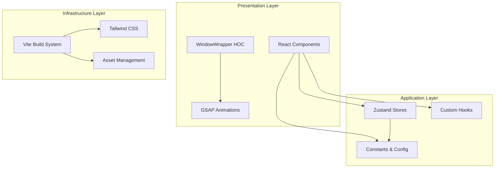
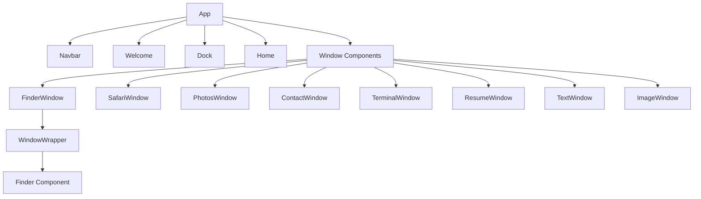
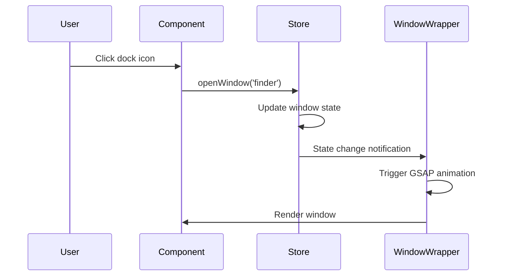

# MacFolio Architecture

This document provides a detailed overview of the MacFolio application's architecture, design patterns, and technical decisions.

## 🏛️ System Overview

MacFolio is a React-based web application that simulates a macOS desktop environment for portfolio presentation. It combines modern web technologies with desktop-like interactions to create an engaging user experience.

## 🏗️ Architecture Diagram



## 📁 Directory Structure

```
src/
├── components/          # Reusable UI components
│   ├── Dock.jsx        # macOS dock implementation
│   ├── Home.jsx        # Desktop folder display
│   ├── Navbar.jsx      # Top navigation
│   ├── Welcome.jsx     # Landing screen
│   └── WindowControls.jsx # Window management controls
├── constants/          # Application constants
│   └── index.js        # Centralized configuration
├── hoc/               # Higher-order components
│   └── WindowWrapper.jsx # Window behavior wrapper
├── store/             # State management
│   ├── location.js    # Finder location state
│   └── window.js      # Window management state
├── windows/           # Window-specific components
│   ├── Contact.jsx    # Contact form window
│   ├── Finder.jsx     # File browser window
│   ├── Image.jsx      # Image viewer window
│   ├── Photos.jsx     # Photo gallery window
│   ├── Resume.jsx     # PDF viewer window
│   ├── Safari.jsx     # Web browser window
│   ├── Terminal.jsx   # Skills terminal window
│   └── Text.jsx       # Text file viewer window
├── App.jsx            # Root component
├── index.css          # Global styles
└── main.jsx           # Application entry point
```

## 🧩 Component Architecture

### Component Hierarchy



### Component Patterns

#### Container/Presentational Pattern
- **Presentational Components**: Pure, reusable UI components (Dock, Home, etc.)
- **Container Components**: Components that manage state and behavior (App, window components)

#### Higher-Order Components (HOC)
- **WindowWrapper**: Adds window behavior (dragging, z-index, animations) to components
- Provides reusable window functionality without code duplication

#### Custom Hooks
- **useGSAP**: GSAP animation integration
- **useWindowStore**: Window state management
- **useLocationStore**: Location state management

## 🗄️ State Management

### Zustand Store Architecture

```javascript
// Window Store Structure
{
    windows: {
        finder: { isOpen: false, zIndex: 1000, data: null },
        safari: { isOpen: false, zIndex: 1000, data: null },
        // ... other windows
    },
    nextZIndex: 1001,
    openWindow: (key, data) => { /* implementation */ },
    closeWindow: (key) => { /* implementation */ },
    focusWindow: (key) => { /* implementation */ }
}

// Location Store Structure
{
    activeLocation: DEFAULT_LOCATION,
    setActiveLocation: (location) => { /* implementation */ },
    resetActiveLocation: () => { /* implementation */ }
}
```

### State Flow



## 🎨 Styling Architecture

### Tailwind CSS Strategy

#### Utility-First Approach
- **Atomic Design**: Small, reusable utility classes
- **Component Variants**: Consistent component styling patterns
- **Responsive Design**: Mobile-first responsive utilities

#### CSS Custom Properties
```css
:root {
    --macos-radius: 8px;
    --macos-shadow: 0 4px 12px rgba(0, 0, 0, 0.15);
    --dock-height: 64px;
}
```

#### Component-Specific Styles
- Window positioning and sizing
- Animation keyframes
- macOS-specific visual elements

## 🎭 Animation System

### GSAP Integration

#### Animation Types
- **Window Transitions**: Open/close animations with scale and opacity
- **Hover Effects**: Dock icon magnification and movement
- **Drag Interactions**: Smooth window dragging with physics
- **Micro-interactions**: Button presses, focus states

#### Animation Configuration
```javascript
// Window opening animation
gsap.fromTo(
    element,
    { scale: 0.8, opacity: 0, y: 40 },
    { scale: 1, opacity: 1, y: 0, duration: 0.4, ease: "power3.out" }
);

// Dock hover effect
gsap.to(icon, {
    scale: 1 + intensity,
    y: -15 * intensity,
    duration: 0.2,
    ease: "power1.out"
});
```

### Draggable Implementation
```javascript
Draggable.create(element, {
    type: "x,y",
    bounds: "body",
    onPress: () => focusWindow(windowKey),
    onDragStart: () => { /* drag start logic */ },
    onDragEnd: () => { /* drag end logic */ }
});
```

## 📊 Data Architecture

### Constants Structure

```javascript
// Hierarchical location data
const locations = {
    work: {
        id: 1,
        type: "work",
        name: "Work",
        kind: "folder",
        children: [
            {
                id: 5,
                name: "Project Name",
                kind: "folder",
                children: [
                    {
                        id: 1,
                        name: "description.txt",
                        kind: "file",
                        fileType: "txt",
                        description: ["..."]
                    }
                ]
            }
        ]
    }
};

// Dock configuration
const dockApps = [
    {
        id: "finder",
        name: "Portfolio",
        icon: "finder.png",
        canOpen: true
    }
];
```

### Data Flow Patterns

#### File System Simulation
- **Locations**: Hierarchical folder structure
- **Files**: Different types (txt, img, url, pdf, fig)
- **Navigation**: Breadcrumb-style location tracking

#### Window Data Management
- **Window State**: Open/closed, z-index, associated data
- **Data Persistence**: Window-specific data storage
- **State Synchronization**: Store updates trigger re-renders

## 🔧 Build System

### Vite Configuration

```javascript
// vite.config.js
export default defineConfig({
    plugins: [
        react(),
        tailwindcss()
    ],
    resolve: {
        alias: {
            "#components": "/src/components",
            "#constants": "/src/constants",
            "#store": "/src/store",
            "#windows": "/src/windows",
            "#hoc": "/src/hoc"
        }
    }
});
```

### Build Optimization
- **Code Splitting**: Route-based and component-based splitting
- **Asset Optimization**: Image compression and optimization
- **Bundle Analysis**: Size monitoring and optimization

## 🧪 Testing Strategy

### Testing Pyramid
- **Unit Tests**: Component and utility function testing
- **Integration Tests**: Component interaction testing
- **E2E Tests**: User journey testing

### Testing Tools
- **Vitest**: Fast unit testing framework
- **React Testing Library**: Component testing utilities
- **Playwright**: E2E testing framework

## 🚀 Performance Considerations

### Optimization Techniques
- **Code Splitting**: Lazy loading of window components
- **Memoization**: React.memo for expensive components
- **Animation Performance**: GPU-accelerated animations
- **Bundle Size**: Tree shaking and dead code elimination

### Performance Metrics
- **First Contentful Paint**: < 1.5s
- **Largest Contentful Paint**: < 2.5s
- **Cumulative Layout Shift**: < 0.1
- **Bundle Size**: < 500KB gzipped

## 🔒 Security Considerations

### Content Security Policy
- **Script Sources**: Restrict to trusted sources
- **Style Sources**: Allow Tailwind and custom styles
- **Image Sources**: Allow project assets and external images

### Data Sanitization
- **User Input**: Sanitize contact form inputs
- **External Links**: Validate URLs before opening
- **File Handling**: Secure file type validation

## 📈 Scalability

### Component Scalability
- **Modular Architecture**: Easy addition of new windows
- **Reusable Patterns**: Consistent component APIs
- **Type Safety**: TypeScript preparation

### Feature Extensibility
- **Plugin System**: Window component registration
- **Configuration-Driven**: Data-driven feature addition
- **API Integration**: External service integration points

## 🔄 Future Enhancements

### Planned Architecture Improvements
- **TypeScript Migration**: Full type safety
- **Component Library**: Extract reusable components
- **Theme System**: Advanced theming capabilities
- **Accessibility**: WCAG 2.1 AA compliance
- **Internationalization**: Multi-language support
- **Offline Support**: Service worker implementation

This architecture provides a solid foundation for the MacFolio application while maintaining flexibility for future enhancements and feature additions.