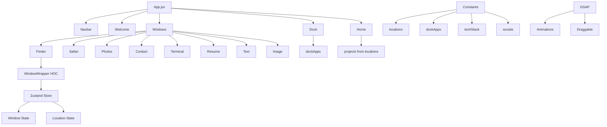

# MacFolio - macOS-Style Portfolio Website

[](https://reactjs.org/)
[](https://vitejs.dev/)
[](https://tailwindcss.com/)
[](https://greensock.com/gsap/)
[](https://zustand-demo.pmnd.rs/)

A sleek, interactive portfolio website designed to mimic the macOS interface, showcasing projects, skills, and personal information in a familiar desktop environment.


## 📋 Table of Contents

- [✨ Features](#-features)
- [🏗️ Architecture](#️-architecture)
- [🛠️ Tech Stack](#️-tech-stack)
- [🚀 Installation](#-installation)
- [📖 Usage](#-usage)
- [📁 Project Structure](#-project-structure)
- [🧩 Components Documentation](#-components-documentation)
- [🗄️ State Management](#️-state-management)
- [🎨 Animations](#-animations)
- [📊 Data Structure](#-data-structure)
- [🔧 Configuration](#-configuration)
- [🤝 Contributing](#-contributing)
- [📄 License](#-license)
- [🙏 Acknowledgments](#-acknowledgments)

## ✨ Features

- **macOS Interface**: Authentic macOS-inspired UI with dock, windows, and desktop elements
- **Interactive Windows**: Draggable, resizable windows for different content types (Finder, Safari, Photos, etc.)
- **Smooth Animations**: GSAP-powered animations for window transitions and hover effects
- **Responsive Design**: Optimized for desktop and mobile devices
- **Project Showcase**: Organized project folders with descriptions, images, and links
- **Contact Integration**: Built-in contact form and social media links
- **Resume Viewer**: PDF resume display with React-PDF
- **Gallery**: Photo gallery with categorized albums
- **Skills Terminal**: Interactive terminal-style skills display
- **Dark/Light Mode**: Theme switching capability

## 🏗️ Architecture



> 📖 **Detailed Architecture Documentation**: See [ARCHITECTURE.md](ARCHITECTURE.md) for comprehensive technical architecture details.

## 🛠️ Tech Stack

### Frontend Framework
- **React 19.2.0** - Modern React with concurrent features
- **Vite 7.2.4** - Fast build tool and dev server

### Styling & UI
- **Tailwind CSS 4.1.18** - Utility-first CSS framework
- **Lucide React** - Beautiful icon library
- **React Tooltip** - Accessible tooltips

### Animations
- **GSAP 3.14.2** - High-performance animation library
- **@gsap/react** - React integration for GSAP

### State Management
- **Zustand 5.0.9** - Lightweight state management
- **Immer 11.1.3** - Immutable state updates

### Utilities
- **clsx** - Conditional CSS classes
- **dayjs** - Date manipulation
- **React PDF** - PDF viewer component

## 🚀 Installation

1. **Clone the repository**
   ```bash
   git clone https://github.com/Sharkofwitch/Mac-Portfolio.git
   cd Mac-Portfolio
   ```

2. **Install dependencies**
   ```bash
   npm install
   ```

3. **Start development server**
   ```bash
   npm run dev
   ```

4. **Build for production**
   ```bash
   npm run build
   ```

5. **Preview production build**
   ```bash
   npm run preview
   ```

## 📖 Usage

### Navigation
- **Dock**: Click icons to open/close windows
- **Desktop**: Click project folders to open in Finder
- **Navbar**: Quick access to main sections

### Windows
- **Drag**: Click and drag window title bars
- **Focus**: Click any window to bring it to front
- **Close**: Use window controls or dock icons

### Key Windows

#### Finder (Portfolio)
Browse projects and personal information in a macOS Finder-like interface.

```jsx
// Opening a project folder
const handleOpenProjectFinder = (project) => {
    setActiveLocation(project);
    openWindow("finder");
}
```

#### Safari (Articles)
View blog posts and external links.

#### Photos (Gallery)
Browse photo albums and images.

#### Contact
Interactive contact form with social links.

#### Terminal (Skills)
Display technical skills in a terminal interface.

#### Resume
PDF viewer for resume display.

## 📁 Project Structure

```
Mac-Portfolio/
├── public/
│   ├── files/          # Static files
│   ├── icons/          # Icon assets
│   └── images/         # Image assets
├── src/
│   ├── components/     # Reusable UI components
│   │   ├── Dock.jsx    # macOS dock with animations
│   │   ├── Home.jsx    # Desktop with project folders
│   │   ├── Navbar.jsx  # Top navigation bar
│   │   ├── Welcome.jsx # Welcome screen
│   │   └── WindowControls.jsx # Window minimize/maximize/close
│   ├── constants/      # App constants and data
│   │   └── index.js    # Locations, dock apps, socials, etc.
│   ├── hoc/            # Higher-order components
│   │   └── WindowWrapper.jsx # Window behavior wrapper
│   ├── store/          # Zustand state stores
│   │   ├── location.js # Active location state
│   │   └── window.js   # Window management state
│   ├── windows/        # Window components
│   │   ├── Contact.jsx # Contact form window
│   │   ├── Finder.jsx  # File browser window
│   │   ├── Image.jsx   # Image viewer window
│   │   ├── Photos.jsx  # Photo gallery window
│   │   ├── Resume.jsx  # Resume viewer window
│   │   ├── Safari.jsx  # Web browser window
│   │   ├── Terminal.jsx # Skills terminal window
│   │   └── Text.jsx    # Text file viewer window
│   ├── App.jsx         # Main app component
│   ├── index.css       # Global styles
│   └── main.jsx        # App entry point
├── index.html          # HTML template
├── package.json        # Dependencies and scripts
├── vite.config.js      # Vite configuration
└── README.md           # This file
```

## 🧩 Components Documentation

### Core Components

#### Dock Component
The macOS-style dock with animated icons and window toggling.

```jsx
const Dock = () => {
    const { openWindow, closeWindow, windows } = useWindowStore();

    // GSAP animation for hover effects
    useGSAP(() => {
        const animateIcons = (mouseX) => {
            icons.forEach((icon) => {
                const distance = Math.abs(mouseX - center);
                const intensity = Math.exp(-(distance ** 2.5) / 20000);

                gsap.to(icon, {
                    scale: 1 + 0.25 * intensity,
                    y: -15 * intensity,
                    duration: 0.2,
                    ease: "power1.out",
                });
            });
        };
    }, []);
};
```

**Features:**
- Magnetic hover animations
- Window open/close toggling
- Tooltip display
- Disabled state handling

#### Home Component
Desktop area displaying project folders.

```jsx
const Home = () => {
    const projects = locations.work?.children ?? [];

    return (
        <section id="home">
            <ul>
                {projects.map((project) => (
                    <li
                        key={project.id}
                        className={clsx("group folder", project.windowPosition)}
                        onClick={() => handleOpenProjectFinder(project)}
                    >
                        
                        <p>{project.name}</p>
                    </li>
                ))}
            </ul>
        </section>
    );
};
```

> 📖 **Complete Components Documentation**: See [COMPONENTS.md](COMPONENTS.md) for detailed documentation of all components, including code examples, features, and usage patterns.

#### WindowWrapper HOC
Provides window behavior to components.

```jsx
const WindowWrapper = (Component, windowKey) => {
    const Wrapped = (props) => {
        const { focusWindow, windows } = useWindowStore();
        const { isOpen = false, zIndex = 0 } = windows[windowKey] ?? {};

        // Opening animation
        useGSAP(() => {
            gsap.fromTo(
                el,
                {scale: 0.8, opacity: 0, y: 40},
                {scale: 1, opacity: 1, y: 0, duration: 0.4, ease: "power3.out"},
            );
        }, [isOpen]);

        // Draggable functionality
        useGSAP(() => {
            Draggable.create(el, {onPress: () => focusWindow(windowKey)});
        }, []);

        return (
            <section
                id={windowKey}
                ref={ref}
                style={{zIndex}}
                className="absolute"
            >
                <Component {...props} />
            </section>
        );
    };
};
```

### Window Components

#### Finder Window
File browser with sidebar navigation and content area.

```jsx
const Finder = () => {
    const { activeLocation, setActiveLocation } = useLocationStore();

    const openItem = (item) => {
        if(item.fileType === "pdf") return openWindow("resume");
        if(item.kind === "folder") return setActiveLocation(item);
        if(['fig', 'url'].includes(item.fileType) && item.href)
            return window.open(item.href, "_blank");

        openWindow(`${item.fileType}${item.kind}`, item);
    };
};
```

## 🗄️ State Management

### Window Store
Manages window states, z-index, and data.

```javascript
const useWindowStore = create(
    immer((set) => ({
        windows: WINDOW_CONFIG,
        nextZIndex: INITIAL_Z_INDEX + 1,

        openWindow: (windowKey, data = null) =>
            set((state) => {
                const win = state.windows[windowKey];
                win.isOpen = true;
                win.zIndex = state.nextZIndex;
                win.data = data ?? win.data;
                state.nextZIndex++;
            }),

        closeWindow: (windowKey) =>
            set((state) => {
                const win = state.windows[windowKey];
                win.isOpen = false;
                win.zIndex = INITIAL_Z_INDEX;
                win.data = null;
            }),

        focusWindow: (windowKey) =>
            set((state) => {
                const win = state.windows[windowKey];
                win.zIndex = state.nextZIndex++;
            }),
    })),
);
```

### Location Store
Manages active location in Finder.

```javascript
const useLocationStore = create(
    immer((set) => ({
        activeLocation: DEFAULT_LOCATION,

        setActiveLocation: (location = null) =>
            set((state) => {
                state.activeLocation = location;
            }),

        resetActiveLocation: () =>
            set((state) => {
                state.activeLocation = DEFAULT_LOCATION;
            }),
    })),
);
```

## 🎨 Animations

### GSAP Integration
The app uses GSAP for smooth animations throughout.

```jsx
// Window opening animation
gsap.fromTo(
    el,
    {scale: 0.8, opacity: 0, y: 40},
    {scale: 1, opacity: 1, y: 0, duration: 0.4, ease: "power3.out"},
);

// Dock hover effects
gsap.to(icon, {
    scale: 1 + 0.25 * intensity,
    y: -15 * intensity,
    duration: 0.2,
    ease: "power1.out",
});
```

### Draggable Windows
Windows can be dragged using GSAP's Draggable plugin.

```jsx
Draggable.create(el, {
    onPress: () => focusWindow(windowKey)
});
```

## 📊 Data Structure

### Locations
Hierarchical data structure for Finder navigation.

```javascript
const WORK_LOCATION = {
    id: 1,
    type: "work",
    name: "Work",
    icon: "/icons/work.svg",
    kind: "folder",
    children: [
        {
            id: 5,
            name: "Nike Ecommerce Website Application",
            icon: "/images/folder.png",
            kind: "folder",
            position: "top-10 left-5",
            windowPosition: "top-[5vh] left-5",
            children: [
                {
                    id: 1,
                    name: "Nike Project.txt",
                    icon: "/images/txt.png",
                    kind: "file",
                    fileType: "txt",
                    position: "top-5 left-10",
                    description: [...],
                },
                // ... more files
            ],
        },
        // ... more projects
    ],
};
```

### Dock Apps
Configuration for dock icons.

```javascript
const dockApps = [
    {
        id: "finder",
        name: "Portfolio",
        icon: "finder.png",
        canOpen: true,
    },
    // ... more apps
];
```

## 🔧 Configuration

### Vite Config
```javascript
import { defineConfig } from 'vite'
import react from '@vitejs/plugin-react'
import tailwindcss from '@tailwindcss/vite'

export default defineConfig({
  plugins: [react(), tailwindcss()],
})
```

### ESLint Config
```javascript
import js from '@eslint/js'
import reactHooks from 'eslint-plugin-react-hooks'
import reactRefresh from 'eslint-plugin-react-refresh'

export default [
  js.configs.recommended,
  {
    plugins: {
      'react-hooks': reactHooks,
      'react-refresh': reactRefresh,
    },
  },
]
```

## 🤝 Contributing

1. Fork the repository
2. Create a feature branch (`git checkout -b feature/amazing-feature`)
3. Commit your changes (`git commit -m 'Add amazing feature'`)
4. Push to the branch (`git push origin feature/amazing-feature`)
5. Open a Pull Request

> 📖 **Detailed Contributing Guidelines**: See [CONTRIBUTING.md](CONTRIBUTING.md) for comprehensive contribution guidelines, development workflow, and coding standards.

## 📄 License

This project is licensed under the MIT License - see the [LICENSE.md](LICENSE.md) file for details.

## 🙏 Acknowledgments

- Inspired by macOS interface design
- Built with modern React and animation libraries
- Icons from Lucide React
- Animations powered by GSAP

---

**Built with ❤️ by Jakob**